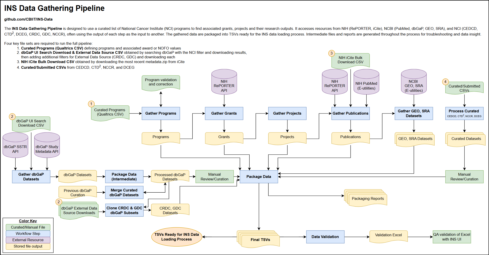

# INS-Data Repository

Welcome to the INS-Data repository for the [Index of NCI Studies (INS)](https://studycatalog.cancer.gov/)! This repository is designed to use a curated list of key National Cancer Institute (NCI) Programs to build lists of all associated extramural grants, projects and their associated publications. This repository accesses resources from  the [NIH RePORTER API](https://api.reporter.nih.gov/), [NIH iCite bulk downloads](https://icite.od.nih.gov/api), and the [NCBI PubMed API](https://www.ncbi.nlm.nih.gov/books/NBK25497/) (through [BioPython](https://biopython.org/docs/1.75/api/Bio.Entrez.html)).


# Table of Contents

- [Data Gathering Workflow](#data-gathering-workflow)
- [How to Use this Repository](#how-to-use-this-repo)
- [Repository Structure](#data-structure)


# Data Gathering Workflow

The INS-Data repository workflow follows the general outline below:  
1. [Gather Programs](#gather-programs)
2. [Gather Grants](#gather-grants)
3. [Gather Projects](#gather-projects)
4. [Gather Publications](#gather-publications)
5. [Package Data](#package-data)





## Gather Programs

**This step gathers programs curated by the [NCI Office of Data Sharing (ODS)](https://datascience.cancer.gov/about/organization#ods).**

**Programs** represent a coherent assembly of plans, project activities, and supporting resources contained within an administrative framework, the purpose of which is to implement an organization's mission or some specific program-related aspect of that mission.

Within INS, programs are the highest-level node. Programs contain projects. 

**Examples**
- [The Childhood Cancer Data Initiative (CCDI)](https://www.cancer.gov/research/areas/childhood/childhood-cancer-data-initiative/about)
- [Cancer Target Discovery and Development (CTD^2)](https://www.cancer.gov/ccg/research/functional-genomics/ctd2)

### Program Workflow

All program processing is handled in the `gather_program_data.py` module and can be run as an independent process with the command: 
```
python modules/gather_program_data.py
```

1. **Process Qualtrics Input**
    - Processes the curated CSV of Programs received from the NCI Office of Data Sharing (ODS). This CSV is an export of survey results from the Qualtrics survey tool. Each Program in this export includes a curation of associated Notices of Funding Opportunities (NOFOs) or Awards.
    - NOTE: Though similar terms, 'Award' is used throughout this documentation to refer to the Award values provided within the Qualtrics CSV, while 'Grant' is used to refer to the grants gathered from NIH RePORTER and used in downstream processing.

2. **Validate provided NOFOs and Awards**
    - Compares each NOFO or Award to expected string formatting patterns to check for validity
    - Generates versioned `invalidAwardReport` and `invalidNofoReport` in the `reports` directory if any unexpected patterns are found
    - Prompts user to review and correct any issues. There are two ways to make corrections:
        1. Make manual changes within the raw qualtrics file `qualtrics_output_{version}_raw.csv` and save as `qualtrics_output_{version}_manual_fix.csv`. Change `QUALTRICS_TYPE` to `manual_fix` within `config.py`.
        2. Add `suggested_fix` and optional `comment` column(s) to the `invalidAwardReport` or `invalidNofoReport` csv and save to the `data/reviewed/{version}/` directory with the `_reviewed` suffix. The validation step will automatically check to see if this file exists and make any suggested changes specified within. If any invalid values still remain after this fix, an `invalidAwardReport_corrected.csv` or `invalidNofoReport_corrected.csv` is generated in the `reports` directory. 

3. **Validate Program names and generate IDs**
    - Checks for duplicates or unexpected combinations in Program Names and Program Acronyms
        - If duplicates are found, then a manual fix must be made to the qualtrics input file to avoid downstream issues. 
        - Save the fixed file as `qualtrics_output_{version}_manual_fix.csv`. Change `QUALTRICS_TYPE` to `manual_fix` within `config.py`.
    - Generates a `program_id` from the Program Acronym

4. **Generate clean Program file**
    - Saves intermediate `program.csv` in versioned `data/01_intermediate/` directory for reference and downstream use
    - The fields expected are defined and can be modified in `config.py`


## Gather Grants

**This step gathers grants from the [NIH RePORTER](https://reporter.nih.gov/). Only grants associated with programs (above) are gathered.**

**Grants** are financial assistance mechanisms providing money, property, or both to an eligible entity to carry out an approved project or activity. A grant is used whenever the NIH Institute or Center anticipates no substantial programmatic involvement with the recipient during performance of the financially assisted activities. 

Within INS, a grant is usually an annual support to a multi-year project. 

**Examples**
- [5U24CA209999-02](https://reporter.nih.gov/project-details/9338199) | Monitoring tumor subclonal heterogeneity over time and space (FY2017)
- [5U24CA209999-03](https://reporter.nih.gov/project-details/9537424) | Monitoring tumor subclonal heterogeneity over time and space (FY2018)
- [5U10CA031946-23](https://reporter.nih.gov/project-details/6749547) | Cancer and Leukemia Group B (FY2004)
- [1P50CA217691-01A1](https://reporter.nih.gov/project-details/9633845) | Emory University Lung Cancer SPORE (FY2019)

### Grant Workflow

All grants processing is handled within the `gather_grant_data.py` module, except for the summary statistic step handled with the `summary_statistic.py` module. They can be run as independent processes with the commands: 
```
python modules/gather_grant_data.py
python modules/summary_statistics.py
```

1. **Get grants data from NIH RePORTER API**
    - This process takes approximately **5-10 minutes** for ~70 programs
    - For each Key Program, this queries the NIH RePORTER API to gather a list of all associated extramural grants along with descriptive data for each grant. 
    - The NOFOs (e.g. `RFA-CA-21-038`; `PAR21-346`) and/or Awards (e.g. `1 U24 CA274274-01`; `P50CA221745`; `3U24CA055727-26S1`) provided for each Key Program are used as the query. 
    - The following exclusion are also applied within the query:
        - Subprojects are excluded
        - Grants prior to fiscal year 2000 are excluded
        - Grants receiving no funding from NCI are excluded

2. **Process grants data**
    - Reformats the data received from the NIH RePORTER API for use within INS. 
        - Removes extraneous fields and rename fields to match the existing INS data model.
        - Flattens nested JSON structures. In particular, the PI, PO, and agency funding fields have this structure. 
        - Formats names to standardize capitalization
    - The fields expected are defined and can be modified in `config.py`

3. **Save grants data for each Program**
    - Adds the associated Program ID to each grant
    - Combines grants data from all programs and store as a versioned `grant.csv` within the `data/01_intermediate/` directory.

4. **Generate summary statistics**
    - Builds reports useful for testing and validation but not intended for ingestion into the site
        - `grantsStatsByProgram.csv` groups grants data by Key Program and aggregates counts of grants, projects, searched values, and earliest fiscal year
        - `sharedProjectsByProgramPair.csv` lists pairs of Key Programs and counts of projects that are associated with both
    - Summary statistics are handled within the `summary_statistics.py` module


## Gather Projects

**This step derives projects from the grants data gathered from [NIH RePORTER](https://reporter.nih.gov/). All projects are associated with at least one program.**

**Projects** are the primary unit of collaborative research effort, sometimes also known as core projects or parent projects. Projects receive funding from awards to conduct research and produce outputs, often across multiple years. 

Within INS, projects are organized as a grouping of grants with identical Activity Code, Institute Code, and Serial Number. 

**Examples**
- [U24CA209999](https://reporter.nih.gov/search/DvzsIDCVf0u9UAR7mykmnA/projects) | Monitoring tumor subclonal heterogeneity over time and space
- [U10CA031946](https://reporter.nih.gov/search/dCmUr6fTQki-RDNTHA81TA/projects) | Cancer and Leukemia Group B

### Project Workflow

All projects processing is handled within the `gather_project_data.py` module and can be run as an independent process with the command: 
```
python modules/gather_project_data.py
```

1. **Aggregate grants into projects**
    - Using the intermediate grants file `grant.csv` as input, this process builds a table of all projects and fills it with information pulled from grants for each project.
    - Each project field is populated using the appropriate aggregation type:

        - **Newest/Oldest**: Some fields should be populated with values from either the newest (e.g. project title, abstract) or oldest (e.g. project start date) grant.
        - **Identical**: Some fields are identical across all grants within a project (e.g. organization and location details). For consistency, the project value is populated with the value from the newest non-supplement grant.
        - **List**: Some fields are populated by gathering and listing all values from all grants within a project (e.g. opportunity number)

    - Newest/oldest grants are decided using the award notice date if available. If not available, fiscal year is used. 
    - Because grant supplements are not always representative of the project, supplements are ignored when pulling newest/oldest values when non-supplement grants are available within a project. 

2. **Validate values and add Program IDs**
    - Validates that all values that should be identical between grants within a project are identical. Any mismatches are reported in `mismatchedProjectValueReport.csv` in the `reports` directory. 
    - Adds Program IDs to projects. To support the data model, any project associated with more than one program will appear multiple times (once for each program).
    - Stores project data in the versioned `project.csv` within the `data/01_intermediate/` directory.


## Gather Publications

**This step gathers publication data from [NIH RePORTER](https://reporter.nih.gov/), [NCBI PubMed](https://pubmed.ncbi.nlm.nih.gov/), and [NIH iCite](https://icite.od.nih.gov/). All publications are associated with at least one project.**

**Publications** gathered for INS only include articles represented in PubMed with a unique PubMed ID.

### Publication Workflow

All publication processing is handled within the `gather_publication_data.py` module and can be run as an independent process with the command:
```
python modules/gather_publication_data.py
```

1. **Get associated PMIDs from the NIH RePORTER API**
    - This process takes approximately **45 minutes** for ~2500 project IDs
    - For each project in `project.csv`, this queries the NIH RePORTER API to gather a list of all associated PubMed IDs (PMIDs)
        - For information on how NIH RePORTER links projects to publications, [see their FAQ](https://report.nih.gov/faqs#:~:text=How%20are%20projects%20linked%20to%20Publications%3F)
    - Note that the project-to-publication link is many-to-many. A single project can be associated with multiple publications, and a single publication can be associated with multiple projects
    - These are stored in the intermediate "checkpoint" file `projectPMIDs.csv`. For subsequent data gathering runs on the same start date (version), this file can be used instead of gathering PMIDs again.

2. **Gather select PubMed information for each PMID**
    - NOTE: This process can take **several hours** to gather information and is highly dependent upon the number of PMIDs gathered. The rate is approximately 15,000-20,000 publications per hour and it is recommended to run this outside of peak hours (9am - 5pm EST)
    - Uses the [BioPython Entrez](https://biopython.org/docs/1.75/api/Bio.Entrez.html) package to access the PubMed API via Entrez e-Utilities and query PMIDs for PubMed information.
    - The following fields are pulled from PubMed:
        - Title
        - Authors
        - Publication date
            - NOTE: Publication dates are inconsistent within the PubMed data. When month and/or date cannot be identified, they will default to January and/or 1st. (e.g. `2010 Dec` would be interpreted as `2010-12-01` and `2010` as `2010-01-01`). Publication year is never estimated. 
    - Because of the long processing time, checkpoint files are saved periodically in a temporary `temp_pubmed_chunkfiles` in the `data/processed/` directory. 
        - The default length of each checkpoint file is 2000 rows, but this can be changed in config.py with `PUB_DATA_CHUNK_SIZE`
        - Whenever this workflow is run for the same start date (version), any existing checkpoint files are all loaded together and the unique PMIDs within are accounted for. Each run will check for any missing PMIDs and restart the data gathering wherever it left off. This allows the publications workflow to be stopped and restarted without problems. 

3. **Gather iCite information for each PMID**
    - Uses the most recent [NIH iCite bulk download](https://nih.figshare.com/collections/iCite_Database_Snapshots_NIH_Open_Citation_Collection_/4586573/48) (zipped CSV) to access iCite data for each PMID
    - This manual download process must be completed **before starting the automated workflow**
        - The downloaded `icite_metadata.zip` should be stored in a versioned (e.g. `2023-11/`) directory in the `data/raw/icite/` directory
            - Note: iCite files are ~10GB and are not stored under git control
        - The download takes **2-4 hours** depending upon download speed. 
        - Note: The iCite API was explored, but operates much slower (3-4x) than the PubMed API. 
    - The following fields are pulled from iCite:
        - Title
        - Authors
        - Publication Year
        - Citation Count
        - Relative Citation Ratio (RCR)
    - Saves checkpoint file `icitePMIDData.csv` containing all iCite data fields for PMIDs of interest

4. **Combine and clean PubMed and iCite data for each PMID**
    - Adds the unique metrics from iCite (Citation Count & RCR) to the PubMed data for each PMID
    - Checks for any missing values in the PubMed information and fill in with iCite information where available
        - When values are conflicting, PubMed is used as the default. iCite values are only used when PubMed value is completely missing
    - Saves checkpoint file `mergedPMIDData.csv` containing all merged PubMed and iCite data for PMIDs of interest
    - Cleans the publications data by removing rows with the following issues:
        - Publication year before 2000
        - No publication information for any fields from PubMed or iCite
    - Stores a report of removed publications in a versioned `removedPublicationsReport.csv` within the `reports/` directory
    - Stores the intermediate publication output `publication.csv` in the versioned `data/01_intermediate/` directory
    


## Package Data

**This step standardizes, validates, and exports all data gathered from other steps of the process.**

### Data Packaging Workflow

All final data packaging steps are handled within the `package_output_data.py` module and can be run as an independent process with the command: 
```
python modules/package_output_data.py
```

1. **Finalize columns in output files**
    - Adds a `type` column and fills with appropriate values required for data loading(e.g. `program` or `project`)
    - Specifies columns and ordering for all files. These can be configured within `config.py`

2. **Standardize characters**
    - Normalizes any non-standard characters within data gathered from sources
    - Characters were normalized using NFKC and then converted to ASCII before saving as UTF-8

3. **Perform special handling steps**
    - Removes any publications with a publication date more than 365 days before the associated project start date
        - This helps to address the overcitation issue occasionally encountered when authors cite inappropriate grant support. See [this 2023 Office of Extramural Research article](https://nexus.od.nih.gov/all/2023/10/05/reminders-about-when-to-cite-an-nih-grant-in-a-paper-overcite-oversight/) for more details on the issue.
        - Any publications removed in this process are saved in a `removedEarlyPublications.csv` in the `reports/../packagingReports` directory.
        - The 365-day buffer can be modified within `config.py`

4. **Validate and save final outputs**
    - Validates that files do not contain duplicates or other inconsistencies 
        - NOTE: Nodes with many-to-many relationships (e.g. `publications`) will have duplicate records where all values are identical __except__ for the linking column (e.g. `project.project_id`). This is intentional. 
    - Validates that all list-like columns are separated by semicolons
    - Generates a list of enumerated values for each column specified in `config.py`. These can be used to update the [INS Data Model](https://github.com/CBIIT/ins-model) before loading.
    - Saves all final outputs as TSV files in the `data/02_outputs` directory. These are ready for INS data loading.


# How to Use this Repository
To recreate the INS data gathering process, follow the steps below.

1. **Clone the repo to your local machine**
    - **Option 1**: Use the [built-in GitHub cloning method](https://docs.github.com/en/desktop/adding-and-cloning-repositories/cloning-and-forking-repositories-from-github-desktop) or a tool like [GitHub desktop](https://desktop.github.com/) 
    - **Option 2**: Open the command terminal and navigate to the desired destination. Run the following:
    ```
    git clone https://github.com/CBIIT/INS-Data.git
    ```
2. **Setup environment**
    - Install either [Anaconda or Miniconda](https://docs.conda.io/projects/conda/en/stable/user-guide/install/download.html#anaconda-or-miniconda)
    - In a command terminal, run the following command in the INS-Data directory:
    ```
    conda env create -f environment.yaml
    ```
    - This will read `environment.yaml`, setup a matching environment, and install any requirements
    - Active the environment either through the [Anaconda Navigator](https://docs.anaconda.com/free/navigator/tutorials/manage-environments/) or with the terminal command:
    ```
    conda activate ins-data-env
    ```
    - If you make changes to the repo that require new or updated packages, update the `environment.yaml` with:
    ```
    conda env export | findstr -v "^prefix:"  > environment.yaml
    ```
    - NOTE: Replace the 'findstr' with 'grep' if using MacOS or Linux. This step removes the local path prefix from the environment.yaml for privacy. 
    
3. **Add or update the input CSV from ODS** 
    - If necessary, update the Qualtrics CSV received from ODS
    - Rename and place it in the `data/00_input/qualtrics/` folder
        - Name should be in the format `qualtrics_output_{version}_{type}.csv` (e.g. `qualtrics_output_2023-07-19_raw.csv`)
    - If the Qualtrics CSV is updated, also update the values for `QUALTRICS_VERSION` and `QUALTRICS_TYPE` in `config.py` to match the Qualtrics CSV as needed.

4. **Download the most recent** [**iCite Database Snapshot**](https://nih.figshare.com/collections/iCite_Database_Snapshots_NIH_Open_Citation_Collection_/4586573/48) 
    - The file is a ~10GB zipped CSV and can take 2-4 hours to manually download
    - Place the file in a versioned raw data directory (i.e. `data/raw/icite/{version}/icite_metadata.zip`)
    - Update the value of `ICITE_VERSION` in `config.py` to match the version directory name (e.g. `2023-11`)

5. **Get an NCBI API Key**
    - Follow [NCBI instructions](https://ncbiinsights.ncbi.nlm.nih.gov/2017/11/02/new-api-keys-for-the-e-utilities/) to register for an NCBI account and get an API key
    - Create a new file in the INS-Data root directory named `.env` and fill with the following:
    ```
    NCBI_EMAIL = <your.name@nih.gov>
    NCBI_API_KEY = <API Key from NCBI>
    ```
    - Replace the values above (without <>) with your email and key
    - NOTE: Because `.env` is listed in `.gitignore`, this file will not be added to GitHub. 
    - **Never commit API keys to GitHub. Keep them on your local.** 
    - Failure to add a valid API key here will increase the 8+ hour PubMed API gathering process to 24+ hours

6. **Run the pipeline**
    - In the command terminal, run the main workflow from the INS-Data root directory with:
    ```
    python main.py
    ```
    - This will run all steps of the workflow and save all output files in file locations defined in `config.py`
    - **OPTIONAL** - Instead of `main.py`, most modules can be run as independent processes with the following commands:
        ```
        python modules/gather_program_data.py
        python modules/gather_grant_data.py
        python modules/summary_statistics.py
        python modules/gather_project_data.py
        python modules/gather_publication_data.py
        python modules/package_output_data.py
        ```
    - NOTE: If running modules independently, ensure that necessary output files from preceding modules already exist for the same start date (version)


# Repository Structure

The entire workflow is captured within `main.py` for simplicity and reproducibility. Functions used within `main.py` are defined in scripts within the `modules/` directory to allow for additional processing steps if needed in the future.  
In general, TSV output files are intended for ingestion into INS, while CSV files are used as inputs, intermediates, or for troubleshooting/reporting.

```
INS-Data
├── data/
│   ├── 00_input/
│   │   ├── icite/
│   │   │   └── {version}/ # Not git-controlled
│   │   │       └── icite_metadata.zip
│   │   └── qualtrics/
│   │       └── qualtrics_output_{version}_{type}.csv
│   ├── 01_intermediate/
│   │   └── {qualtrics version}/
│   │       ├── {gathered version}/
│   │       │   ├── temp_pubmed_chunkfiles/ # Not git-controlled
|   |       |   |   └── Partial PubMed files for iterative loading
│   │       │   ├── icitePMIDData.csv
│   │       │   ├── mergedPMIDData.csv
│   │       │   ├── project.csv
│   │       │   ├── projectPMIDs.csv
│   │       │   └── publication.csv
│   │       ├── invalidNofoReport_reviewed.csv
│   │       └── key_programs_{version}.csv
│   └── 02_output/ # Work in progress
│       ├── program.tsv
│       ├── project.tsv
│       └── publication.tsv
├── images/
│   ├── ins-data-repo-diagram.drawio
│   └── ins-data-repo-diagram.png
├── modules/
│   ├── data_preparation.py
│   ├── gather_grant_data.py
│   ├── gather_publication_data.py
│   └── summary_statistics.py
├── notebooks/
│   └── Non-production Jupyter notebooks used during development
├── reports/
│   └── {qualtrics version}/
│       ├── {gathered version}/
│       │   ├── grantsStatsByProgram.csv
│       │   ├── removedPublicationsReport.csv
│       │   └── sharedProjectsByProgramPair.csv
│       ├── invalidAwardReport_raw.csv
│       ├── invalidNofoReport_corrected.csv
│       ├── invalidNofoReport_manual_fix.csv
│       └── invalidNofoReport_raw.csv
├── .env # Not git-controlled
├── .gitignore
├── config.py
├── environment.yaml
├── main.py
└── README.md
```
