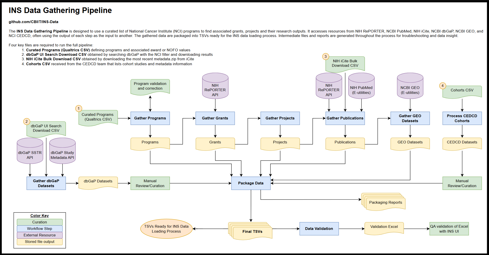

# INS-Data Repository

Welcome to the INS-Data repository for the [Index of NCI Studies (INS)](https://studycatalog.cancer.gov/)! This repository is designed to use a curated list of Key NCI Programs to build a list of all associated extramural grants and their associated publications. This  repository accesses resources from  the [NIH RePORTER API](https://api.reporter.nih.gov/), [NIH iCite bulk downloads](https://icite.od.nih.gov/api), and the [NCBI PubMed API](https://www.ncbi.nlm.nih.gov/books/NBK25497/) (through [BioPython](https://biopython.org/docs/1.75/api/Bio.Entrez.html)).


## Table of Contents

- [Worfklow](#workflow)
- [Usage](#usage)
- [Data Structure](#data-structure)


## Workflow

The INS-Data repository workflow follows the general outline below:  
1. [Programs](#programs)
2. [Grants](#grants)
3. [Publications](#publications)




### Programs
All program processing is handled in the `data_preparation.py` module. This will be updated/expanded in the future.

1. **Process Qualtrics CSV**
    - Receive curated CSV of Key Programs from the NCI Office of Data Sharing (ODS). This CSV is an export of survey results from the Qualtrics survey tool. Each Key Program in this export includes a curation of associated Notices of Funding Opportunities (NOFOs) and/or Awards.
        - NOTE: Though similar terms, 'Award' is used throughout this documentation to refer to the Award values provided within the Qualtrics CSV, while 'Grant' is used to refer to the grants gathered from NIH RePORTER and used in downstream processing.
    - Validate that all provided NOFOs and Awards match expected format patterns
        - Generate versioned `invalidAwardReport` and `invalidNofoReport` in the `reports` directory if any unexpected patterns are found
        - Prompt user to review and correct any issues. There are two ways to make corrections:
            1. Make manual changes within the raw qualtrics file `qualtrics_output_{version}_raw.csv` and save as `qualtrics_output_{version}_manual_fix.csv`. Change `QUALTRICS_TYPE` to `manual_fix` within `config.py`.
            2. Add `suggested_fix` and optional `comment` column(s) to the `invalidAwardReport` or `invalidNofoReport` csv and save to the `data/reviewed/{version}/` directory with the `_reviewed` suffix. The validation step will automatically check to see if this file exists and make any suggested changes specified within. If any invalid values still remain after this fix, an `invalidAwardReport_corrected.csv` or `invalidNofoReport_corrected.csv` is generated in the `reports` directory. 
    - Save cleaned Key Programs CSV for reference and downstream use
    - The fields expected are defined and can be modified in `config.py`


### Grants

1. **Get grants data from NIH RePORTER API**
    - This process takes approximately **5-10 minutes** for ~70 programs
    - For each Key Program, query the NIH RePORTER API to gather a list of all associated extramural grants along with descriptive data for each grant. 
    - The NOFOs (e.g. `RFA-CA-21-038`; `PAR21-346`) and/or Awards (e.g. `1 U24 CA274274-01`; `P50CA221745`; `3U24CA055727-26S1`) provided for each Key Program are used as the query. 
    - The following exclusion are also applied within the query:
        - Subprojects are excluded
        - Grants prior to fiscal year 2000 are excluded
        - Grants receiving no funding from NCI are excluded
    - Function(s) defined in `nih_reporter_api.py` module

2. **Process grants data**
    - Reformat the data received from the NIH RePORTER API for use within INS. 
        - Remove extraneous fields and rename fields to match the existing INS data model.
        - Flatten nested JSON structures. In particular, the PI, PO, and agency funding fields have this structure. 
        - Format names to standardize capitalization
    - The fields expected are defined and can be modified in `config.py`
    - Function(s) defined in `clean_grants_data.py` module

3. **Save grants data for each Key Program**
    - Add a program.program_id to each grant.
        - Note: Because not all Key Programs have an ID, acronym, etc., IDs are created using a form of the Key Program name where spaces and non-alphanumeric characters are removed. (e.g. `BarrettsEsophagusTranslationalResearchNetworkBETRNet`)
    - Combine grants data from all programs and store as a versioned `project.tsv` within the `data/processed/` directory.

4. **Generate summary statistics**
    - Build reports useful for testing and validation but not intended for ingestion into the site
        - `grantsStatsByProgram.csv` groups grants data by Key Program and aggregates counts of grants, projects, searched values, and earliest fiscal year
        - `sharedProjectsByProgramPair.csv` lists pairs of Key Programs and counts of projects that are associated with both


### Publications
All publication processing is handled within the `gather_publication_data.py` module.

1. **Get associated PMIDs from the NIH RePORTER API**
    - This process takes approximately **45 minutes** for ~2500 project IDs
    - For each project in `project.tsv`, query the NIH RePORTER API to gather a list of all associated PubMed IDs (PMIDs)
        - For information on how NIH RePORTER links projects to publications, [see their FAQ](https://report.nih.gov/faqs#:~:text=How%20are%20projects%20linked%20to%20Publications%3F)
    - Note that the project-to-publication link is many-to-many. A single project can be associated with multiple publications, and a single publication can be associated with multiple projects
    - These are stored in the intermediate "checkpoint" file `projectPMIDs.csv`. For subsequent data gathering runs on the same start date (version), this file can be used instead of gathering PMIDs again.

2. **Gather select PubMed information for each PMID**
    - This process can take approximately **8 hours** to gather information for ~150,000 PMIDs and is usually run overnight. 
    - Use the [BioPython Entrez](https://biopython.org/docs/1.75/api/Bio.Entrez.html) package to access the PubMed API via Entrez e-Utilities and query PMIDs for PubMed information.
    - The following fields are pulled from PubMed:
        - Title
        - Authors
        - Publication date
            - NOTE: Publication dates are inconsistent within the PubMed data. When month and/or date cannot be identified, they will default to January and/or 1st. (e.g. `2010 Dec` would be interpreted as `2010-12-01` and `2010` as `2010-01-01`). Publication year is never estimated. 
    - Because of the long processing time, checkpoint files are saved periodically in a temporary `temp_pubmed_chunkfiles` in the `data/processed/` directory. 
        - The default length of each checkpoint file is 2000 rows, but this can be changed in config.py with `PUB_DATA_CHUNK_SIZE`
        - Whenever this workflow is run for the same start date (version), any existing checkpoint files are all loaded together and the unique PMIDs within are accounted for. Each run will check for any missing PMIDs and restart the data gathering wherever it left off. This allows the publications workflow to be stopped and restarted without problems. 

3. **Gather iCite information for each PMID**
    - Use the most recent [NIH iCite bulk download](https://nih.figshare.com/collections/iCite_Database_Snapshots_NIH_Open_Citation_Collection_/4586573/48) (zipped CSV) to access iCite data for each PMID
    - This manual download process must be completed **before starting the automated workflow**
        - The downloaded `icite_metadata.zip` should be stored in a versioned (e.g. `2023-11/`) directory in the `data/raw/icite/` directory
            - Note: iCite files are ~10GB and are not stored under git control
        - The download takes **2-4 hours** depending upon download speed. 
        - Note: The iCite API was explored, but operates much slower than the PubMed API. Additional runtime was estimated at 20+ hours to gather required fields for ~150,000 publications. 
    - The following fields are pulled from iCite:
        - Title
        - Authors
        - Publication Year
        - Citation Count
        - Relative Citation Ratio (RCR)
    - Save checkpoint file `icitePMIDData.csv` containing all iCite data fields for PMIDs of interest

4. **Combine and clean PubMed and iCite data for each PMID**
    - Add the unique metrics from iCite (Citation Count & RCR) to the PubMed data for each PMID
    - Check for any missing values in the PubMed information and fill in with iCite information where available
        - When values are conflicting, PubMed is used as the default. iCite values are only used when PubMed value is completely missing
    - Save checkpoint file `mergedPMIDData.csv` containing all merged PubMed and iCite data for PMIDs of interest
    - Clean the publications data by removing rows with the following issues:
        - Publication year before 2000
        - No publication information for any fields from PubMed or iCite
    - Store a report of removed publications in a versioned `removedPublicationsReport.csv` within the `reports/` directory
    - Store the final publication output `publication.tsv` in a versioned `data/processed/` directory
    


## Usage

1. **Clone the repo to your local machine**
    - **Option 1**: Use the [built-in GitHub cloning method](https://docs.github.com/en/desktop/adding-and-cloning-repositories/cloning-and-forking-repositories-from-github-desktop) or a tool like [GitHub desktop](https://desktop.github.com/) 
    - **Option 2**: Open the command terminal and navigate to the desired destination. Run the following:
    ```
    git clone https://github.com/CBIIT/INS-Data.git
    ```
2. **Setup environment**
    - Install either [Anaconda or Miniconda](https://docs.conda.io/projects/conda/en/stable/user-guide/install/download.html#anaconda-or-miniconda)
    - In a command terminal, run the following command in the INS-Data directory:
    ```
    conda env create -f environment.yaml
    ```
    - This will read `environment.yaml`, setup a matching environment, and install any requirements
    - Active the environment either through the [Anaconda Navigator](https://docs.anaconda.com/free/navigator/tutorials/manage-environments/) or with the terminal command:
    ```
    conda activate ins-data-env
    ```
    - If you make changes to the repo that require new or updated packages, update the `environment.yaml` with:
    ```
    conda env export | findstr -v "^prefix:"  > environment.yaml
    ```
    - NOTE: Replace the 'findstr' with 'grep' if using MacOS or Linux. This step removes the local path prefix from the environment.yaml for privacy. 
    
3. **Add or update the input CSV from ODS** 
    - If necessary, update the Qualtrics CSV received from ODS
    - Rename and place it in the `data/raw/` folder
        - Name should be in the format `qualtrics_output_{version}_{type}.csv` (e.g. `qualtrics_output_2023-07-19_raw.csv`)
    - If the Qualtrics CSV is updated, also update the values for `QUALTRICS_VERSION` and `QUALTRICS_TYPE` in `config.py` to match the Qualtrics CSV as needed.

4. **Download the most recent** [**iCite Database Snapshot**](https://nih.figshare.com/collections/iCite_Database_Snapshots_NIH_Open_Citation_Collection_/4586573/48) 
    - The file is a ~10GB zipped CSV and can take 2-4 hours to manually download
    - Place the file in a versioned raw data directory (i.e. `data/raw/icite/{version}/icite_metadata.zip`)
    - Update the value of `ICITE_VERSION` in `config.py` to match the version directory name (e.g. `2023-11`)

5. **Get an NCBI API Key**
    - Follow [NCBI instructions](https://ncbiinsights.ncbi.nlm.nih.gov/2017/11/02/new-api-keys-for-the-e-utilities/) to register for an NCBI account and get an API key
    - Create a new file in the INS-Data root directory named `.env` and fill with the following:
    ```
    NCBI_EMAIL = <your.name@nih.gov>
    NCBI_API_KEY = <API Key from NCBI>
    ```
    - Replace the values above (without <>) with your email and key
    - NOTE: Because `.env` is listed in `.gitignore`, this file will not be added to GitHub. 
    - **Never commit API keys to GitHub. Keep them on your local.** 
    - Failure to add a valid API key here will increase the 8+ hour PubMed API gathering process to 24+ hours

6. **Run the pipeline**
    - In the command terminal, run the main workflow from the INS-Data root directory with:
    ```
    python main.py
    ```
    - This will run all steps of the workflow and save all output files in file locations defined in `config.py`
    - **OPTIONAL** - Instead of `main.py`, most modules can be run as standalones with the following commands:
        - NOTE: If running standalones, ensure that necessary output files from preceding modules already exist for the same start date (version)
        ```
        python modules/data_preparation.py
        python modules/summary_statistics.py
        python modules/gather_publication_data.py
        ```


## Structure

The entire workflow is captured within `main.py` for simplicity of use and reproducibility of data. Functions used within `main.py` are defined in scripts within the `modules/` directory to allow for additional processing steps if needed in the future.  
In general, TSV output files are intended for ingestion into INS, while CSV files are used as intermediates or for troubleshooting/reporting.

```
INS-Data
├── data/
│   ├── cleaned/
│   │   └── key_programs_{version}.csv
│   ├── processed/
│   │   └── {version}/
│   │       └── api-gathered-{gathering date}/
│   |           ├── temp_pubmed_chunkfiles/ # Not git-controlled
│   |           |   └── Many publicationDetail.csvs limited to 2000 rows
│   |           ├── icitePMIDData.csv
│   |           ├── mergedPMIDData.csv
│   |           ├── project.tsv
│   |           ├── projectPMIDs.csv
│   |           └── publication.tsv
│   ├── raw/
│   │   ├──icite
│   │   |   ├── {version}/ # Not git-controlled
│   │   |   |   └── icite_metadata.zip 
│   │   |   └── icite_files_not_stored.txt
│   │   └── qualtrics_output_{version}_{type}.csv
│   └── reviewed/
│       └── {version}/
│           ├── invalidAwardReport_reviewed.csv
│           └── invalidNofoReport_reviewed.csv
├── images/
│   ├── ins-data-repo-diagram.drawio
│   └── ins-data-repo-diagram.png
├── modules/
│   ├── clean_grants_data.py
│   ├── data_preparation.py
│   ├── gather_publication_data.py
│   ├── nih_reporter_api.py
│   └── summary_statistics.py
├── notebooks/
│   └── Non-production Jupyter notebooks used during development
├── reports/
│   └── {version}/
│       ├── api-gathered-{gathering date}/
│       │   ├── grantStatsByProgram.csv
│       │   ├── removedPublicationsReport.csv
│       │   └── sharedProjectsByProgramPair.csv
│       ├── invalidAwardReport_{type}.csv
│       └── invalidNofoReport_{type}.csv
├── .env # Not git-controlled
├── .gitignore
├── config.py
├── environment.yaml
├── main.py
└── README.md
```
